# 🌺 Kew-MNIST Synthetic Data Enhancement

[](https://www.python.org/downloads/)
[](https://tensorflow.org/)
[](https://opensource.org/licenses/MIT)

Improving botanical image classification accuracy from **91.97%** to **93.42%** using AI-generated synthetic data augmentation.

<p align="center">
  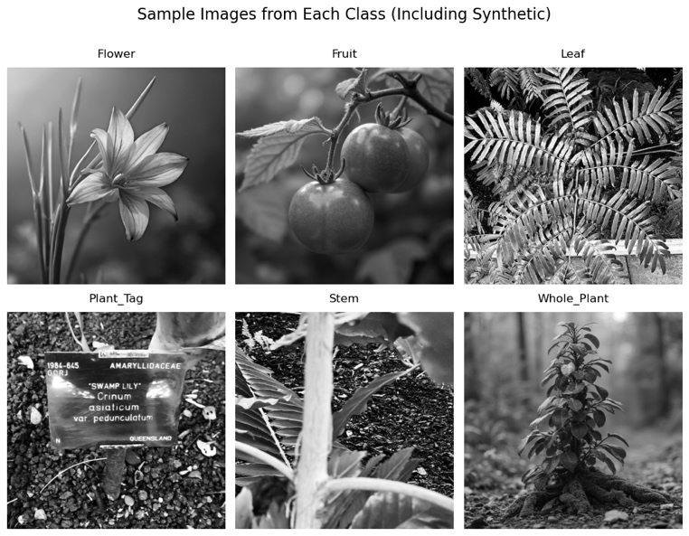
</p>

## 📊 Key Results

Our synthetic data augmentation approach demonstrates significant improvements across all metrics:

<p align="center">
  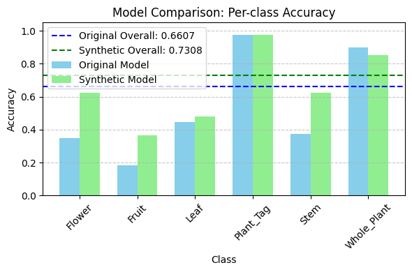
</p>

| Metric | Original Model | Synthetic-Enhanced | Improvement |
|--------|---------------|-------------------|-------------|
| **Overall Accuracy** | 91.97% | **93.42%** | +1.45% |
| **Weighted F1** | 0.919 | **0.934** | +0.015 |
| **Fruit Class Accuracy** | 80.21% | **87.50%** | +7.29% |
| **Stem Class Accuracy** | 82.46% | **90.35%** | +7.89% |

## 🚀 Quick Start

```bash
# Clone the repository
git clone https://github.com/yusufmo1/kew-mnist-synthetic.git
cd kew-mnist-synthetic

# Create virtual environment
python -m venv venv
source venv/bin/activate  # On Windows: venv\Scripts\activate

# Install dependencies
pip install -r requirements.txt

# Download data and train models
python scripts/download_data.py
python scripts/train_models.py

# Evaluate models
python scripts/evaluate.py
```

## 🎯 Project Overview

This project enhances the Kew-MNIST botanical dataset using carefully curated synthetic images generated with Flux.1-dev. By addressing class imbalance through targeted synthetic data generation, we achieve:

- **Balanced dataset**: From 6:1 to 1.5:1 class ratio
- **Improved minority class performance**: Up to 12% accuracy gains
- **Robust feature learning**: Models focus on botanically relevant features

<p align="center">
  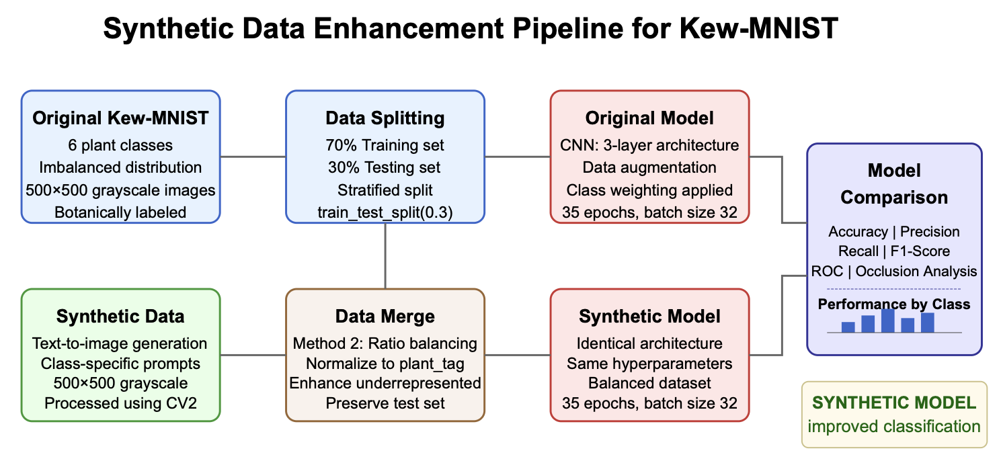
</p>

### Dataset Enhancement

#### Original Dataset Distribution

<p align="center">
  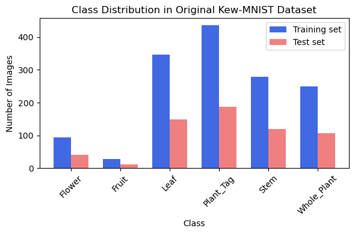
</p>

#### Enhanced Dataset Distribution

<p align="center">
  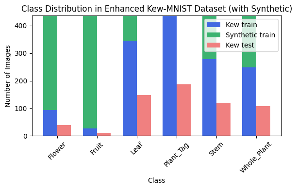
</p>

| Class | Original | Added | Total | Change |
|-------|----------|-------|-------|---------|
| flower | 544 | +360 | 904 | +66% |
| fruit | 252 | +652 | 904 | +259% |
| leaf | 813 | +91 | 904 | +11% |
| plant_tag | 904 | 0 | 904 | 0% |
| stem | 437 | +467 | 904 | +107% |
| whole_plant | 366 | +538 | 904 | +147% |

### Sample Images

#### Original Kew-MNIST Samples

<p align="center">
  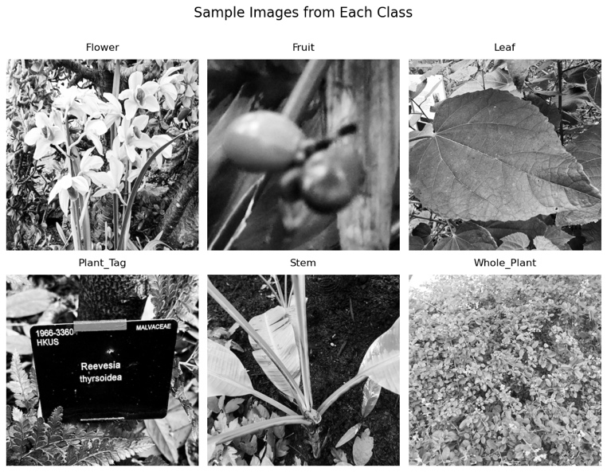
</p>

#### Synthetic Generated Samples

<p align="center">
  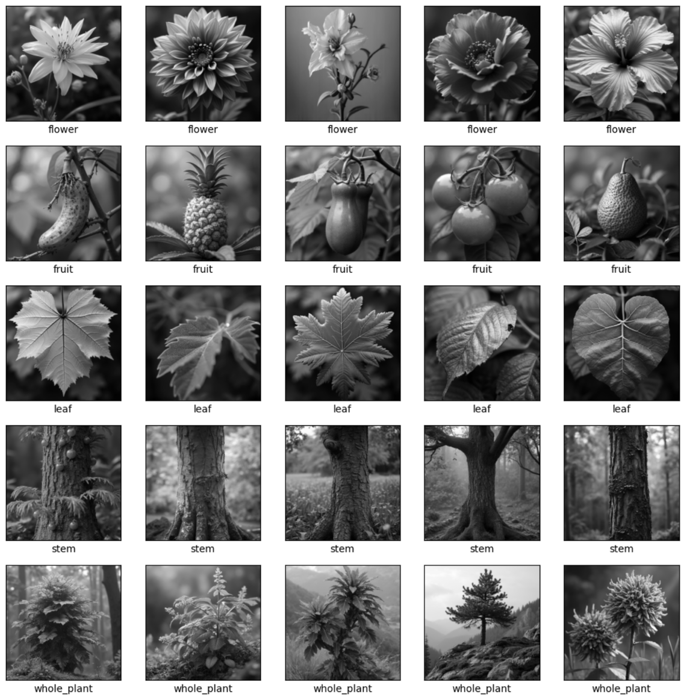
</p>

#### Average Class Representatives

<p align="center">
  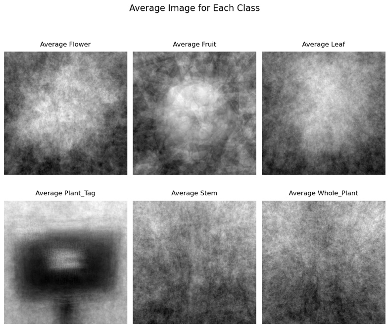
  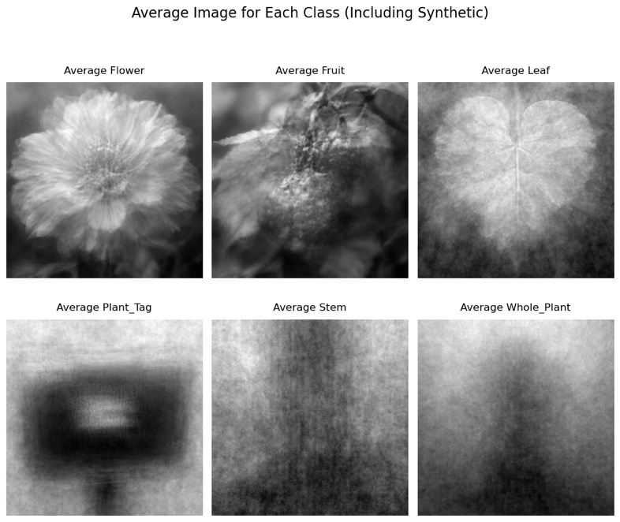
</p>

## 📁 Project Structure

```
kew-mnist-synthetic/
├── README.md              # Project overview
├── requirements.txt       # Dependencies
├── Dockerfile            # Container setup
├── docker-compose.yml    # Easy deployment
├── app.py               # Streamlit demo
├── config.yaml          # Configuration
├── notebooks/           # Analysis notebooks
│   ├── 01_data_exploration.ipynb
│   ├── 02_model_comparison.ipynb
│   └── 03_results_analysis.ipynb
├── src/                 # Core modules
│   ├── data_loader.py   # Data utilities
│   ├── models.py        # CNN architecture
│   ├── trainer.py       # Training logic
│   └── utils.py         # Helper functions
├── scripts/             # Automation
│   ├── download_data.py
│   ├── train_models.py
│   └── run_analysis.py
└── docs/images/         # Visualizations
```

## 🧠 Model Architecture

Our CNN architecture is optimized for botanical image classification:

<p align="center">
  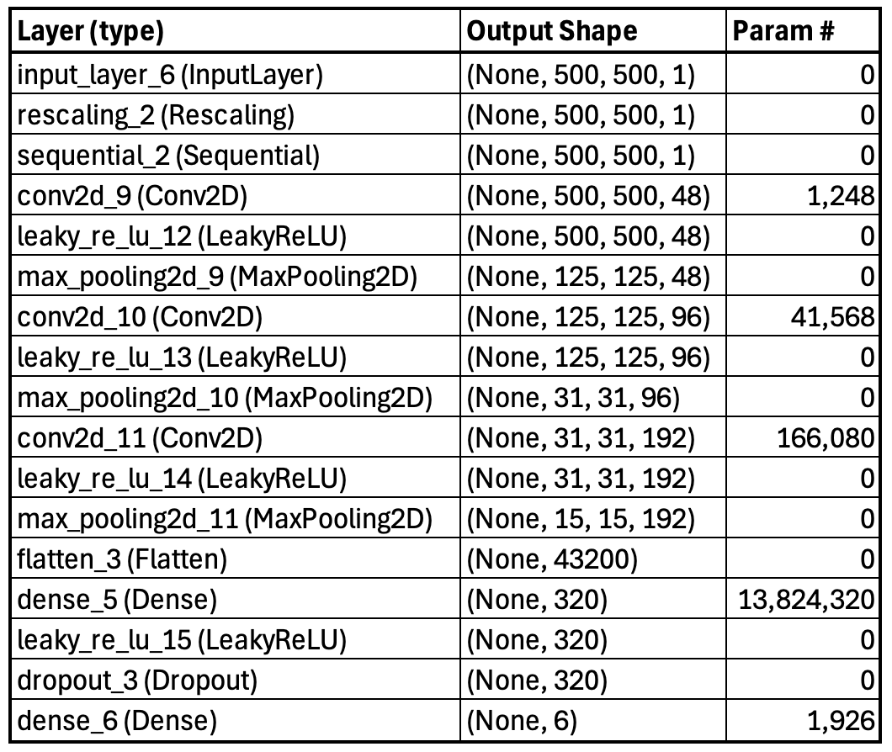
</p>

```python
Model: KewCNN
Input: 500×500×1 grayscale images
Architecture:
  - Conv2D(48, 5×5) → LeakyReLU → MaxPool(4×4)
  - Conv2D(96, 3×3) → LeakyReLU → MaxPool(4×4)
  - Conv2D(192, 3×3) → LeakyReLU → MaxPool(2×2)
  - Dense(320) → LeakyReLU → Dropout(0.4)
  - Dense(6, softmax)
```

<p align="center">
  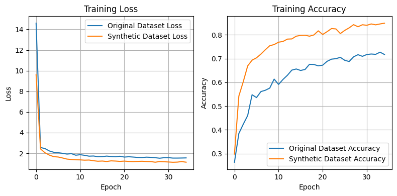
</p>

### Training Progress

#### Original Model Accuracy

<p align="center">
  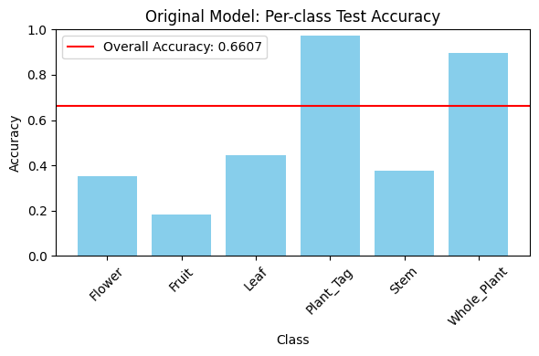
</p>

#### Synthetic-Enhanced Model Accuracy

<p align="center">
  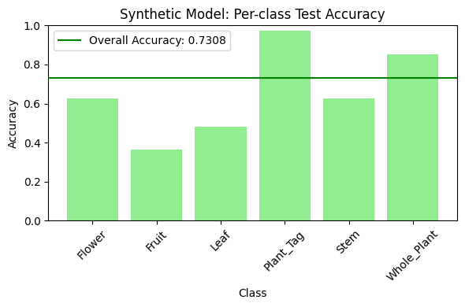
</p>

## 📊 Comprehensive Evaluation

### Confusion Matrices

<p align="center">
  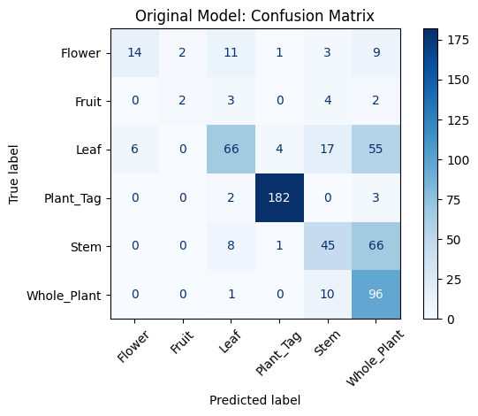
  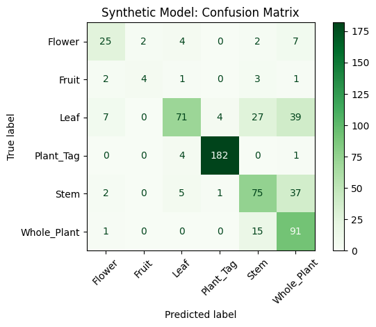
</p>

### Performance Metrics

<p align="center">
  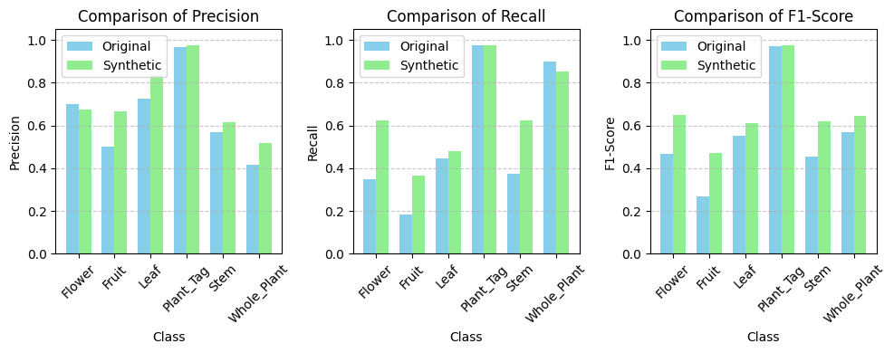
</p>

### ROC Curves Analysis

<p align="center">
  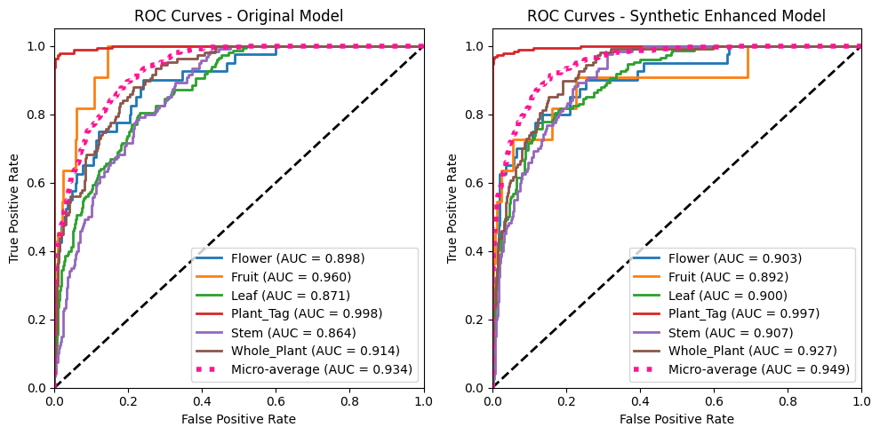
</p>

### Sample Predictions

#### Original Model Predictions

<p align="center">
  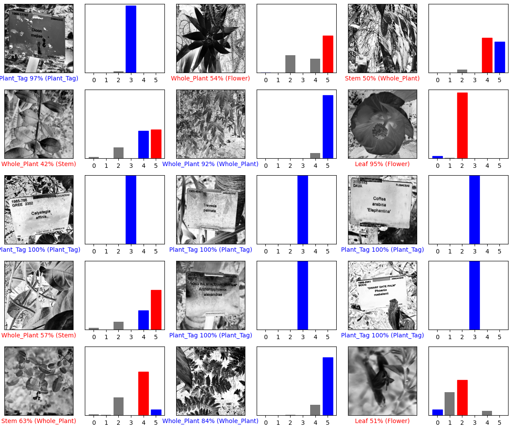
</p>

#### Synthetic-Enhanced Model Predictions

<p align="center">
  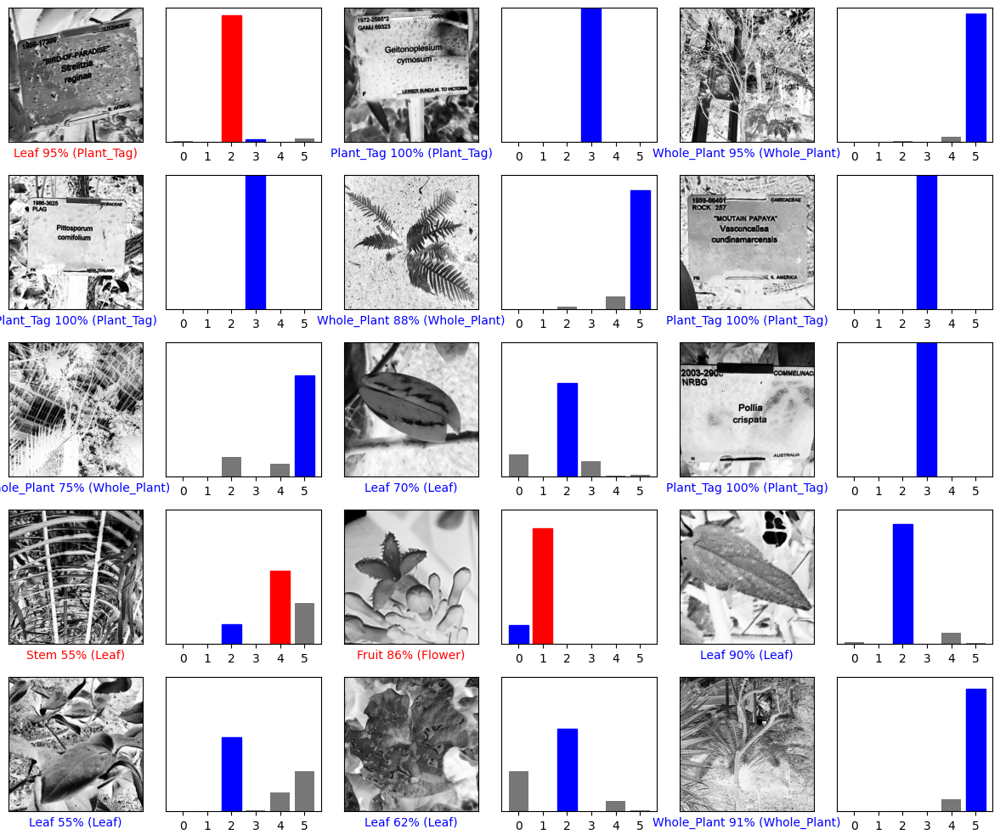
</p>

### Model Interpretability

<p align="center">
  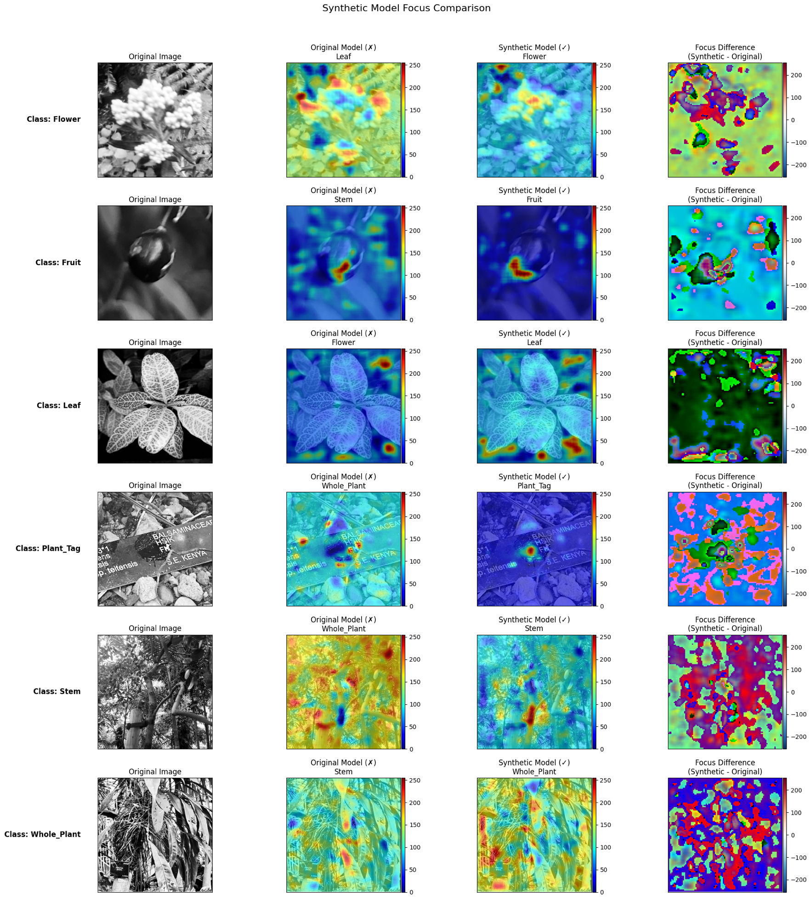
</p>

The occlusion analysis reveals that synthetic-enhanced models learn more botanically relevant features, focusing less on background artifacts.

## 🖼️ Streamlit Demo App

Try our interactive web application:

```bash
streamlit run app.py
```

Features:
- Upload and classify botanical images
- Compare model predictions
- Visualize classification confidence
- Explore the dataset

## 🐳 Docker Deployment

```bash
# Build and run with docker-compose
docker-compose up --build

# Or build manually
docker build -t kew-mnist-synthetic .
docker run -p 8501:8501 kew-mnist-synthetic
```

## 📓 Interactive Notebooks

Explore the complete analysis through our Jupyter notebooks:

1. **Data Exploration**: Dataset statistics, visualizations, and quality analysis
2. **Model Comparison**: Training curves, performance metrics, and ablation studies
3. **Results Analysis**: Statistical tests, error analysis, and publication figures

## 🔄 Run Complete Pipeline

```bash
# Run all steps: download, train, evaluate
python scripts/run_analysis.py
```

## 📈 Performance Benchmarks

- **Training Time**: Original (5m47s) vs Synthetic (12m12s) on Apple M3 Max
- **Memory Usage**: 128GB system RAM, optimized for Apple Silicon
- **Dataset Size**: Original (1GB) + Synthetic (500MB)
- **Hardware**: Apple M3 Max with 96GB unified memory

## 📖 Citation

```bibtex
@software{kew_mnist_synthetic2025,
  author = {Mohammed, Yusuf},
  title = {Kew-MNIST Synthetic Data Enhancement},
  year = {2025},
  publisher = {GitHub},
  url = {https://github.com/yusufmo1/kew-mnist-synthetic}
}
```

## 📄 License

This project is licensed under the MIT License - see [LICENSE](LICENSE) for details.

## 🙏 Acknowledgments

- **QMUL Students** for the original Kew-MNIST dataset
- **Queen Mary University of London** for academic support
- **Flux.1-dev** by Black Forest Labs for synthetic image generation

---

<p align="center">
  <strong>Contact</strong><br>
  <a href="https://github.com/yusufmo1">GitHub</a> • 
  <a href="https://www.linkedin.com/in/yusuf-mohammed1/">LinkedIn</a> • 
  Queen Mary University of London
</p>